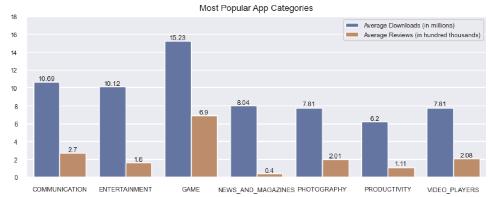
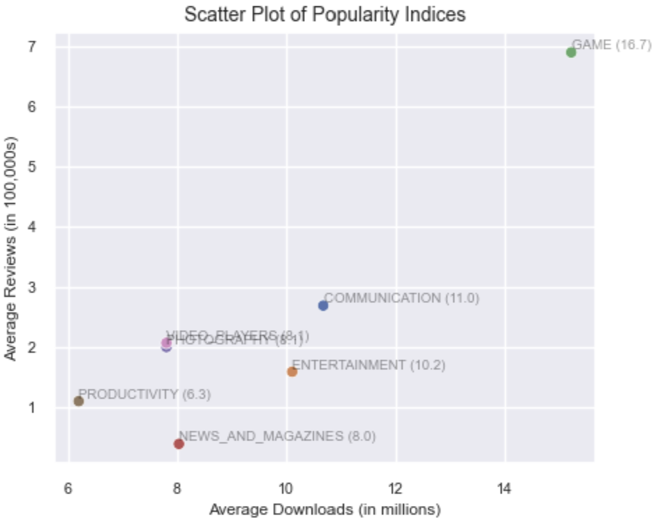
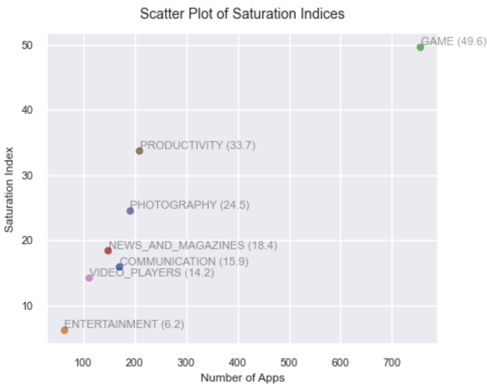

# App Profile Data Analysis

This project analyzes a Google Play Store dataset to propose an optimal app profile for a fictional client. The client aims to develop a free, English-language app that generates revenue solely through advertisements. The analysis focuses on identifying app characteristics that attract the most users.

_Note: This README was generated with assistance from [ChatGPT](https://chatgpt.com), but all project code was written entirely by the author._

---

## Features

- Data cleaning and preprocessing of the Google Play Store dataset
- Exploratory data analysis (EDA) to uncover trends and patterns
- Visualization of key metrics using Matplotlib and Seaborn
- Insights to inform app development strategies

---

## Sample Visualizations






## Technologies Used

- Python
- Pandas
- NumPy
- Matplotlib
- Seaborn
- Jupyter Notebook

---

## Getting Started

### Prerequisites

- Python 3.x
- Jupyter Notebook
- Required Python libraries: Pandas, NumPy, Matplotlib, Seaborn

### Installation
1. Clone the repository (Linux - `bash`, Windows: `git bash`):
   ```bash
   git clone https://github.com/kingsley-ezenwaka/app-profile-data-analysis.git
   ```
   
   Alternatively, you can simply download the repo by clicking on the green "Code" button and select "Download zip".

3. Navigate to the project directory:
   ```bash
   cd app-profile-data-analysis
   ```

4. Install the required libraries (if not already installed):
   ```bash
   pip install pandas numpy matplotlib seaborn notebook
   ```
   Or:
   ```cmd
   py -m pip install pandas numpy matplotlib seaborn notebook
   ```
   
6. Launch Jupyter Notebook:
   ```bash
   jupyter notebook
   ```

7. Open and run the `app-profiles-analysis.ipynb` notebook to explore the analysis.

---

## Key Insights

- Free apps tend to have higher install counts compared to paid apps
- Certain categories, such as Games and Communication, dominate in user engagement
- App size and user ratings can influence the number of installs

---

## Future Enhancements

- Integrate interactive visualizations using Plotly or Streamlit
- Incorporate machine learning models to predict app success metrics
- Expand the dataset to include more recent app data for a comprehensive analysis

---

## Project Structure

```
app-profile-data-analysis/
├── app-profiles-analysis.ipynb
├── app-profiles-analysis.py
├── googleplaystore.csv
├── googleplaystore_rev.csv
└── README.md
```
---

## Acknowledgements

The project idea is borrowed directly from [dataquest.io](https://www.dataquest.io/projects/guided-project-a-profitable-app-profiles-for-the-app-store-and-google-play-markets-2/). Modifications have been made to the original project instructions.
